# Assignment 504 #
## HHA 504 Assignment Networking 

# Azure
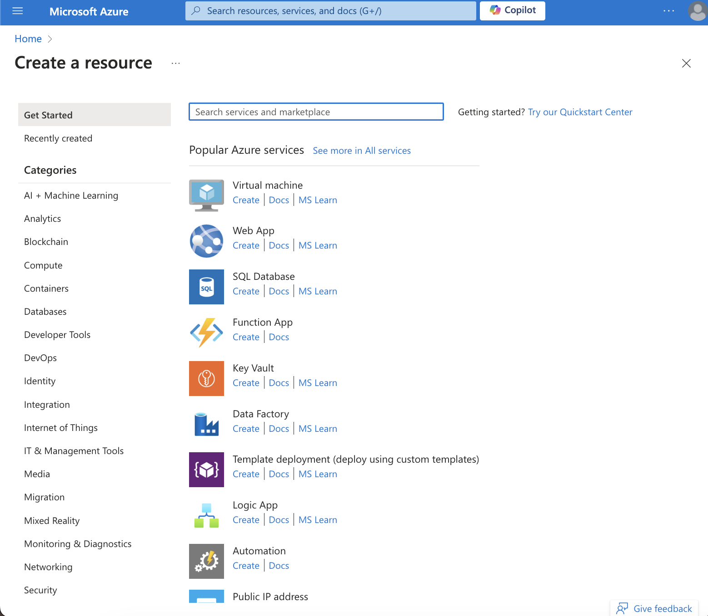

    Select "Create Virtual Network" 

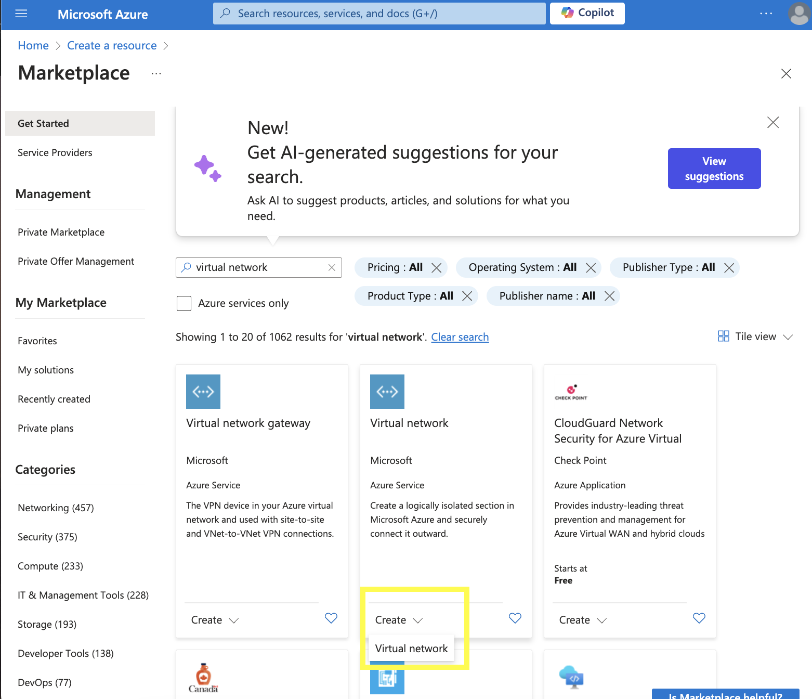

    Enter fields

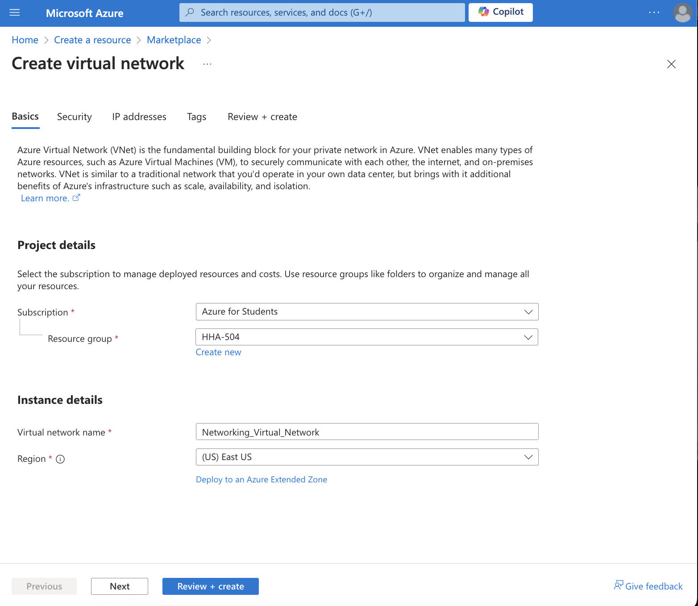

    Completed Deployment

    Overview of Deployment
    

    Select "Create DNS Zone"
    

    Deployment Complete

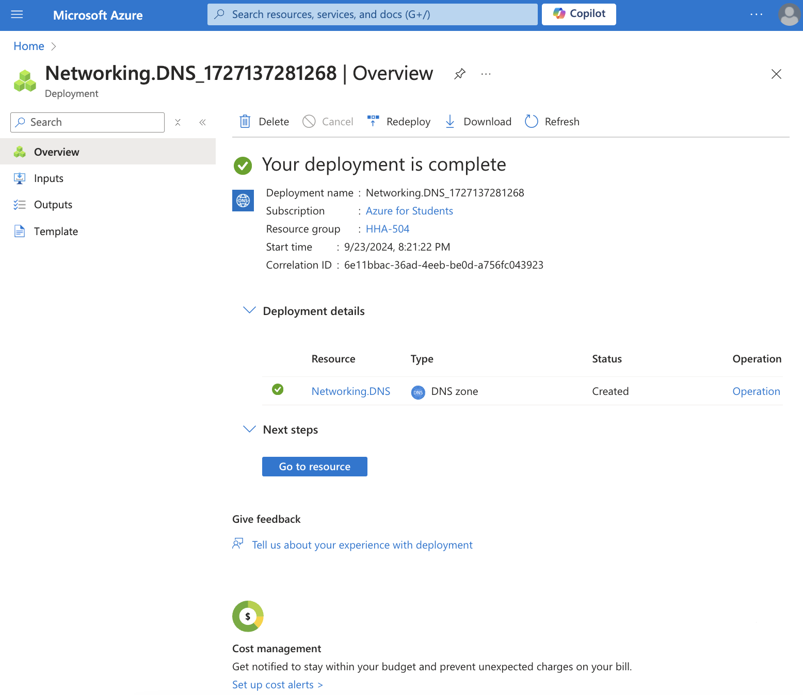

    Overview

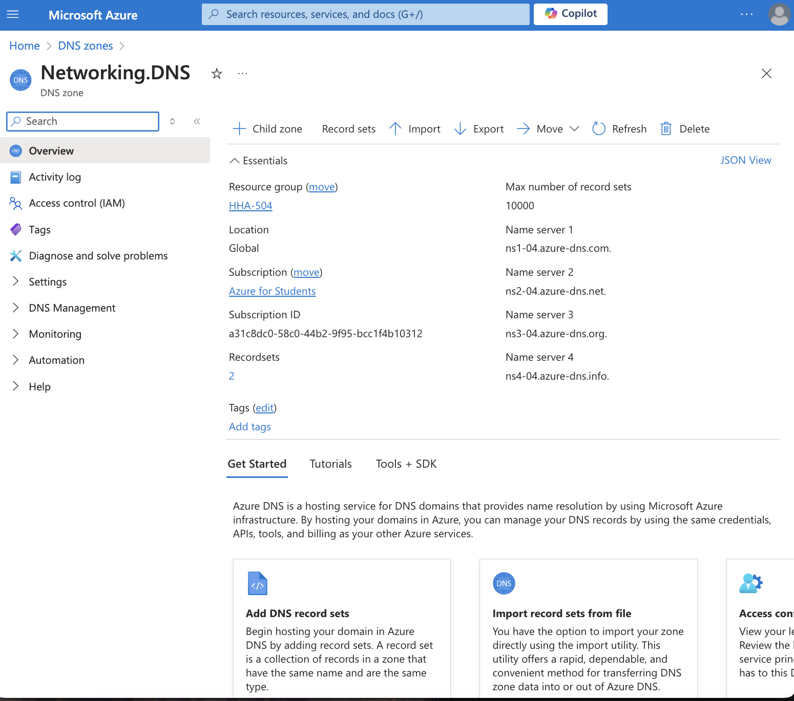

    Select "Create Virtual Network Gateway" 

    Enter fields

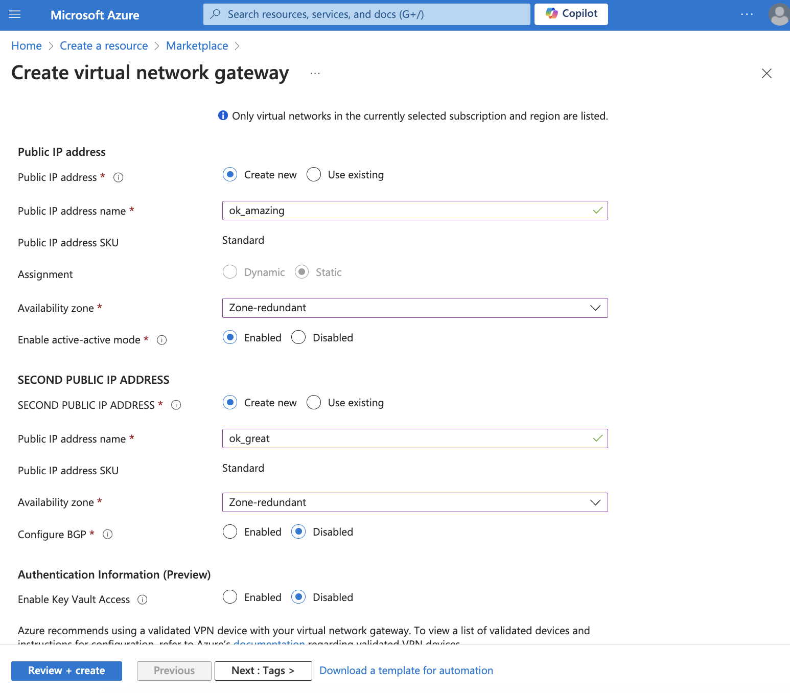

    Passed Validation

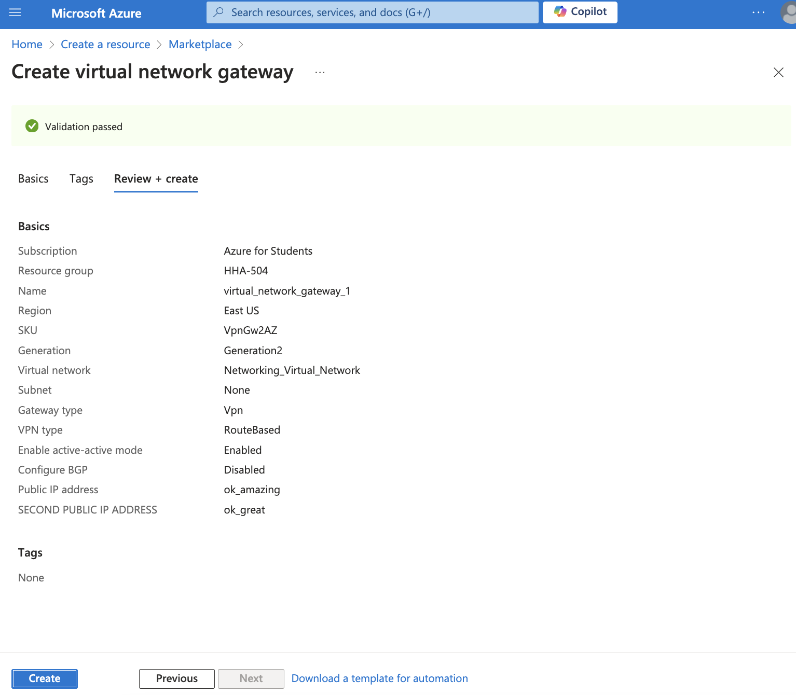

# GCP

    Select "VPC networks" from "VPC Network" sidetab

    Enter fields

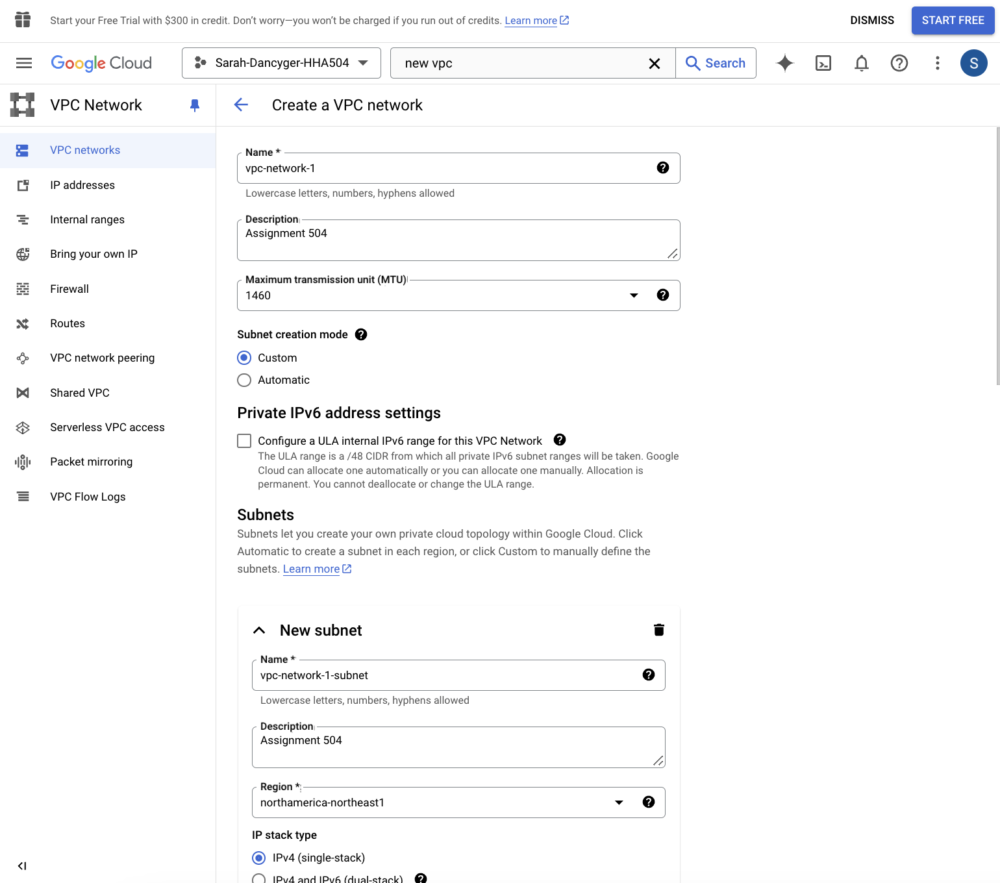

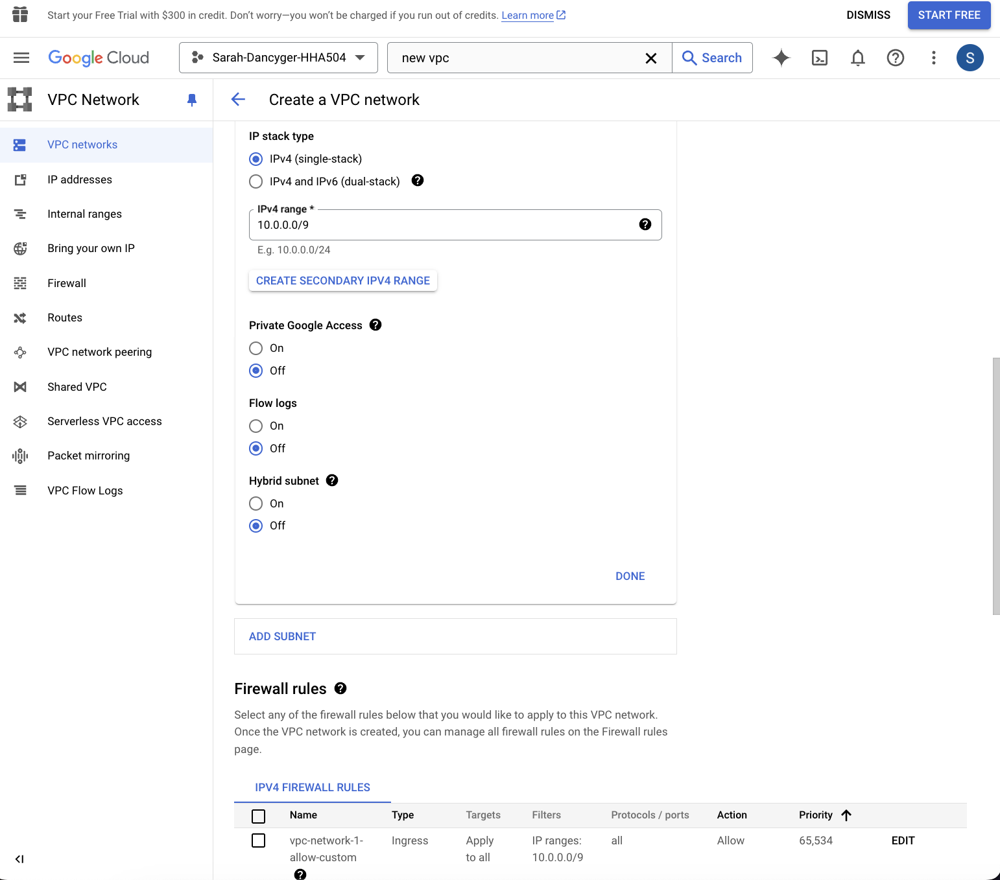

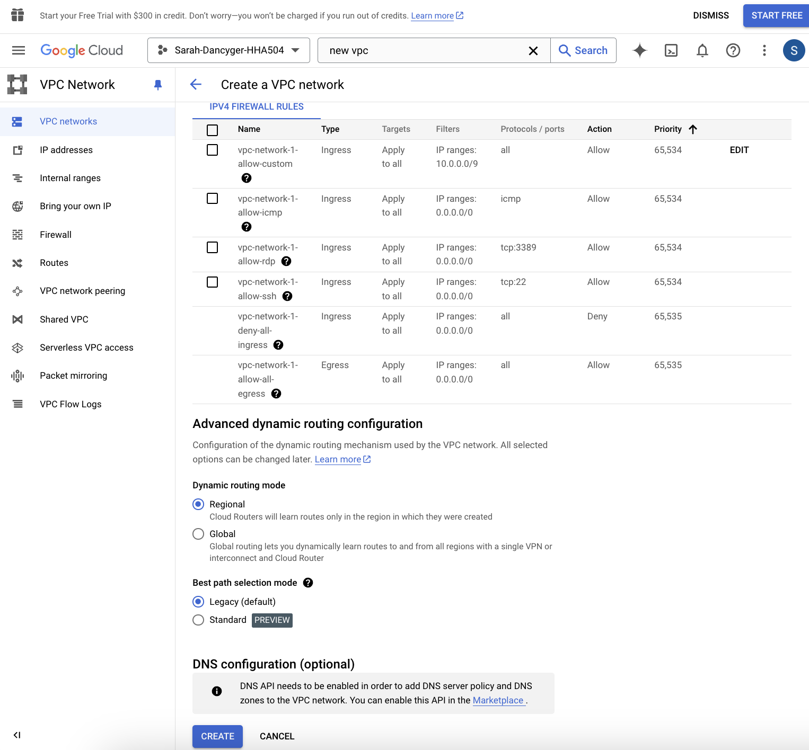

    Created VPC Network

    
    Select "IP addresses"

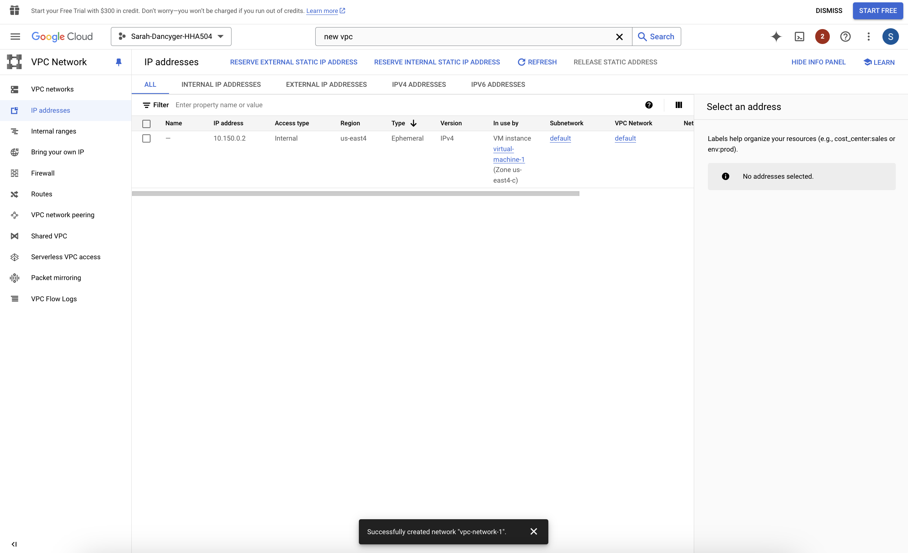

    Select "External IP Addresses"

    Enter fields

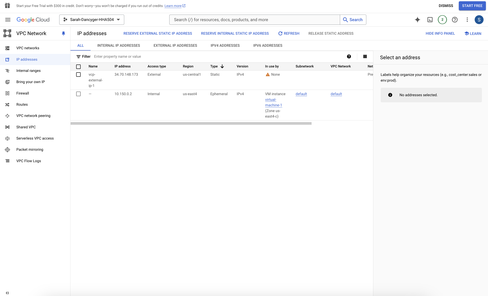

    Successful configuration

## *Notes*
- I found both Microsoft Azure and GCP platforms easy to navigate, input, and view.

- Microsoft Azure platform had a greater variety of colors within the pages which assisted in easy differentiation between sections.